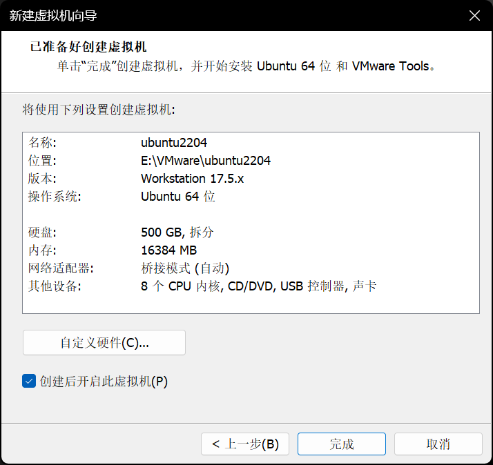
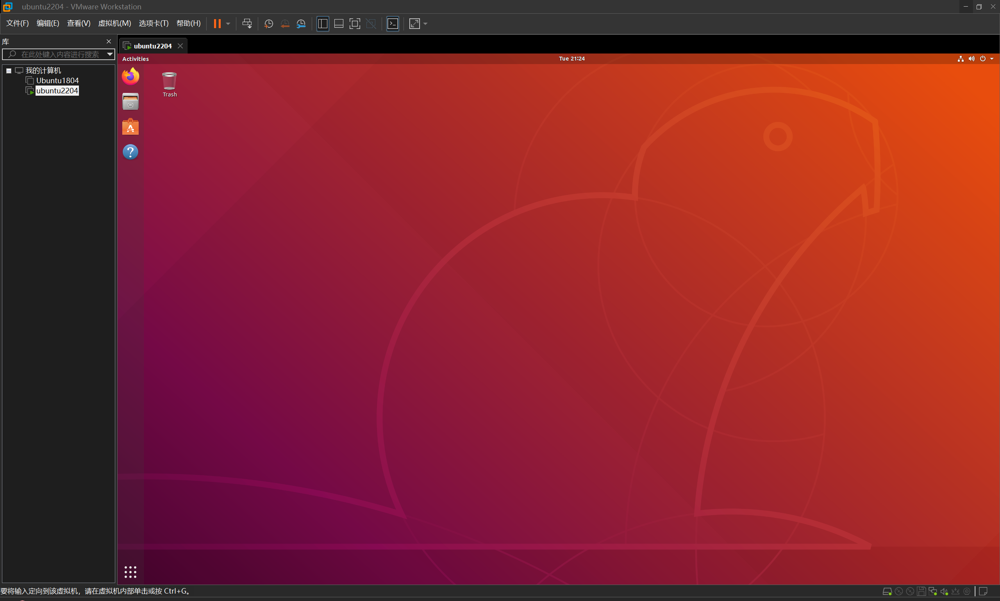

# 2026-07-29：Ubuntu 22.04 VMware 开发环境与交叉工具链记录

> 目的：建立可长期用于 RK3566 SDK、内核、设备树和驱动学习的 Linux 开发主机。
> 本记录不包含 Wi-Fi 密码、root 密码等敏感信息。

## 1. 方案结论

固定采用：

```text
Windows 主机
  → VMware Workstation Pro
    → Ubuntu 22.04.5 LTS Desktop amd64
      → SSH / SCP
        → 泰山派 RK3566（Buildroot，AArch64）
```

选择 Ubuntu 22.04.5 的原因：后续 SDK、内核、设备树和驱动开发有较好的兼容性，且比 Ubuntu 18.04 更适合作为长期主环境。旧 Ubuntu 18.04 虚拟机保留但不再作为主开发环境。

## 2. 虚拟机配置

| 项目 | 配置 |
|---|---|
| VMware | VMware Workstation Pro 中文界面 |
| 客户机系统 | Ubuntu 22.04.5 LTS Desktop amd64（`jammy`） |
| 内存 | 16 GB |
| CPU | 1 个虚拟处理器 × 8 核，共 8 vCPU |
| 虚拟磁盘 | 500 GB、NVMe、分拆文件、动态分配 |
| 网络 | 桥接模式 |
| 时区 | `Asia/Shanghai` |

硬件设置截图：



## 3. Ubuntu 系统确认

系统版本：

```text
Ubuntu 22.04.5 LTS (Jammy Jellyfish)
```

重启后的内核：

```text
Linux ubuntu2204 6.8.0-136-generic ... x86_64
```

已确认：

```text
Time zone: Asia/Shanghai (CST, +0800)
System clock synchronized: yes
NTP service: active
```

安装完成后出现 Ubuntu 24.04.4 LTS 升级提示时，选择 **Don't Upgrade**；当前学习环境固定在 Ubuntu 22.04.5，不升级到 24.04。


## 4. 网络与 SSH 验证

Ubuntu 桥接网卡：

```text
ens33: 192.168.30.233/24
```

泰山派：

```text
wlan0: 192.168.30.227/24
默认网关: 192.168.30.1
```

Ubuntu 对开发板的第二轮 Ping 验证结果：

```text
4 packets transmitted, 4 received, 0% packet loss
```

SSH 验证：

```bash
ssh root@192.168.30.227
```

已成功进入：

```text
root@taishanpi:~#
```

### 一次路由异常的处置

开发板曾出现 `wlan0` 已有 `192.168.30.227/24`，但 `ip route list` 无输出的情况；此时无法主动访问 Ubuntu。通过串口前台执行 DHCP 续租后，路由恢复：

```text
default via 192.168.30.1 dev wlan0
192.168.30.0/24 dev wlan0 scope link src 192.168.30.227
```

恢复后 Ubuntu 与开发板 Ping、SSH 都正常。该异常尚未完成“开发板重启后是否复发”的复测，因此不应凭一次现象修改板端持久化网络脚本。

## 5. VMware 集成工具

Ubuntu 直接使用发行版维护的开源工具，而不是 VMware 菜单中挂载 ISO 的旧式安装流程：

```bash
sudo apt install -y open-vm-tools open-vm-tools-desktop
```

系统返回这两个软件包已经是最新版本，说明已具备鼠标、自动分辨率和剪贴板等集成功能。

终端粘贴使用：

```text
Ctrl + Shift + V
```

终端中单独按 `Ctrl + C` 是中断命令，显示 `^C` 属于正常行为，并不表示剪贴板失效。



## 6. 系统更新与基础依赖

已执行：

```bash
sudo apt update
sudo apt full-upgrade
sudo reboot
```

已安装的嵌入式开发基础依赖：

```bash
sudo apt install -y build-essential gcc-aarch64-linux-gnu \
  binutils-aarch64-linux-gnu gdb-multiarch git vim tree file rsync \
  bc bison flex libssl-dev libelf-dev libncurses-dev dwarves \
  device-tree-compiler cpio
```

这里的 `file` 与 `rsync` 是两个独立包名；误写成 `filersync` 会导致 APT 报：

```text
E: Unable to locate package filersync
```

重新使用正确包名后安装完成。

## 7. 交叉编译器确认

执行：

```bash
aarch64-linux-gnu-gcc --version
```

输出：

```text
aarch64-linux-gnu-gcc (Ubuntu 11.4.0-1ubuntu1~22.04.3) 11.4.0
```

含义：

- Ubuntu 本机架构为 `x86_64`；
- 泰山派运行的架构为 `aarch64`；
- `aarch64-linux-gnu-gcc` 在 x86 Ubuntu 上运行，生成可在 ARM64 Linux 上执行的 ELF 程序。

该 Ubuntu 通用工具链先用于第一个静态链接 C 程序。后续编译 SDK、内核模块，或程序要依赖 Buildroot 专用库时，改用与目标系统匹配的 SDK/toolchain 和 sysroot。

## 8. VMware 快照

已创建：

1. `01-Ubuntu2204-Updated-Network-OK`
   - 系统更新完成；时区正确；桥接网络正常；可 SSH 到 RK3566；VMware 集成工具已确认。
2. `02-Ubuntu2204-CrossTools-Ready`
   - 在快照 01 基础上，交叉编译器与内核/设备树基础依赖安装完成并验证。

## 9. 后续工作原则与下一步

- SDK、内核源码、设备树源码和项目工作区放在 Ubuntu 虚拟机的 ext4 文件系统，例如 `~/workspace`；
- 不在 Windows NTFS 共享目录中直接解压或构建内核源码，避免权限、符号链接、大小写和文件名语义差异；
- 不需要为了第一个 `hello.c` 立即解压完整 SDK；
- 下一步进入第 6 课：创建 `hello.c`，生成静态链接 AArch64 ELF，检查 ELF，使用 `scp` 上传到 `/userdata`，在泰山派运行并检查退出码。
